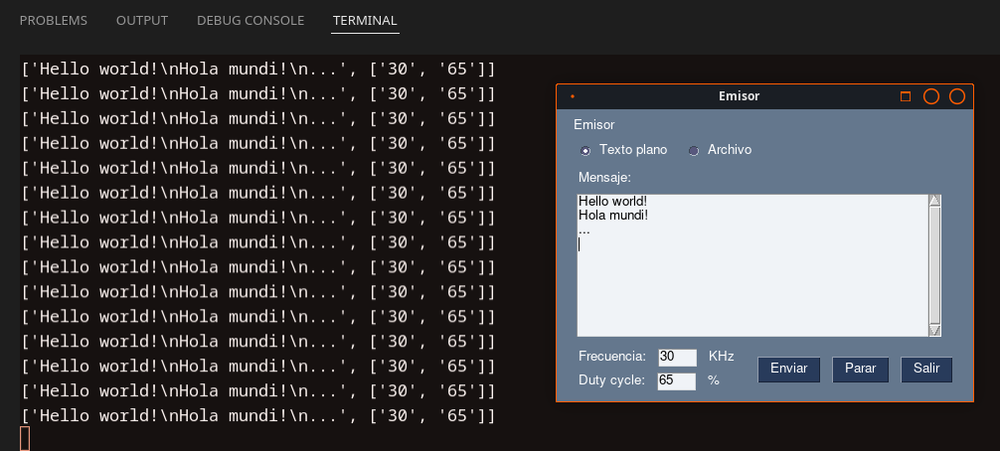
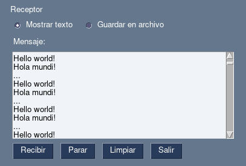

# Dummies GUI

This program provides a simple GUI to easily use the dummies during the Optical Communications tests.


## Requirements

To use the program, you need to have installed the following requirements:

- Python 3.6 or higher
- PySimpleGUI 4.70.1
- Tkinter 8.6 


## How to use

In this repository, you will find two main python files: `emisor.py` and `receptor.py`. Each file is responsible for the GUI of the transmitter and receiver dummies, respectively.

To run each of the dummies programs, you need to execute the following commands in the terminal of the respective dummies (or in the same computer but different terminals while testing):


### Transmitter Dummy

```bash
python emisor.py
```

After running the command, a window like the following will appear:



To send a message, you can select the message type between text or file. If you choose the text option, you can write the message in the text box; otherwise, you can select the file from your computer.

You can also adjust parameters like the transmission frequency and the duty cycle of the LEDs (these parameters where set as an example for the first development iteration).

Finally, you can press the "Enviar" button to send the message and the "Parar" button to stop the transmission.


### Receiver Dummy

```bash
python receptor.py
```

After running the command, a window like the following will appear:



To receive a message from the transmitter, you have to select the message type between text or file. If you choose the text option, the message will be displayed in the text box; otherwise, you can select the file name and the folder where it will be saved.

Then, if the message type is text, you can press the "Recibir" button to start the reception process, the "Parar" button to stop it and the "Limpiar" button to clear the text box content; otherwise, if the message type is file, you can press the "Recibir" button to start the reception process and the "Parar" button to stop it.

## Troubleshooting

If you get the following error message when trying to run the program:

    _tkinter.TclError: couldn't connect to display "$DISPLAY"

It could be because the program is trying to open a window in the display `$DISPLAY`, but it is not allowed. To solve this issue, you need to allow the program to open a window in the display `$DISPLAY`.

You can try to run the following command in the terminal:
   
```bash
xhost +local:
```


## Disclaimer

This program is still under development, most of the functionalities are not implemented yet, specially the ones related to the file transmission.
