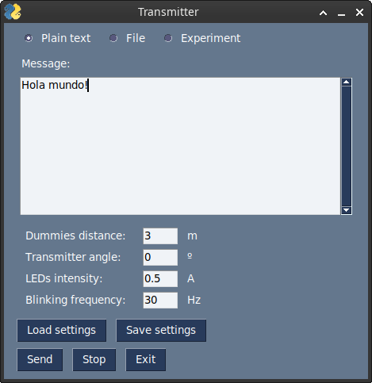
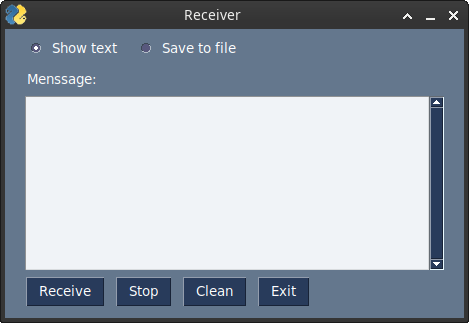

# Dummies GUI

This program provides a simple GUI to easily use the dummies during the Optical Communications tests.

## Requirements

To use the program, you need to have installed the following requirements:

- Python 3.6 or higher
- PySimpleGUI 4.70.1
- Tkinter 8.6 

## Configuration secrets

The GUI resolves all backend endpoints and debug flags from a local `.env` file. Prepare it before launching either script:

1. Duplicate the template: `cp .env.example .env`.
2. Set the variables according to your deployment, for example:
    ```ini
    DEBUG_MODE=false
    TRANSMITTER_SERVER_BASE_URL=your_url:your_port
    RECEIVER_SERVER_BASE_URL=your_url:your_port
    ```
3. Start the GUI via the provided launch scripts (`./launch-transmitter.sh --build`, `./launch-receiver.sh --build`) so Docker Compose picks up the values.

Keep `.env` out of version control—`.gitignore` already does this—and rotate the URLs or credentials if a populated file is ever committed inadvertently.

## How to use

In this repository, you will find two main folders: `transmitter` and `receiver`. Each folder contains the respective GUI application (`transmitter-gui.py` and `receiver-gui.py`) designed to act as dummies during Optical Communications tests.

Depending on your testing scenario, you can run these applications using Docker (useful for testing the whole system on a single machine) or as standalone Python scripts (ideal when running the transmitter and receiver on two different computers).

### Option 1: Using Docker
This method is useful if you want to run both GUIs and the backend servers on the same computer.

From the root directory of the repository, run:
```bash
docker compose up --build
```

This command will automatically build the images and open both the Transmitter and Receiver windows.

### Option 2: Standalone Execution
If you are deploying the transmitter and the receiver on different computers, you can run the GUIs directly using Python. First, make sure to set up a virtual environment and install the requirements from the root directory:

```bash
python3 -m venv venv
source venv/bin/activate
pip install -r requirements.txt
```

### Transmitter Dummy

To run the transmitter, navigate to its folder and execute the script:
```bash
cd transmitter
python3 transmitter-gui.py
```

After running the command, a window like the following will appear:



Once the application opens, you can select between four transmission modes using the radio buttons at the top: **Plain text, File, Experiment, and Sequence**. 

Depending on the needs of your test, you can also adjust various optical communication parameters from the main window, such as the dummies distance, transmitter angle, LEDs intensity, blinking frequency, and the messages batch. Before sending, a convenient checkbox allows you to choose whether to encode your message to binary or send it as raw text. 

Finally, use the **"Send"** button to dispatch your data, **"Stop"** to halt the transmission at any time, and "Exit" to safely close the application.

### Receiver Dummy
To run the receiver, navigate to its folder and execute the script:

```bash
cd receiver
python3 receiver-gui.py
```

After running the command, a window like the following will appear:



In the receiver interface, you can choose how the incoming data is handled by selecting one of four modes: **Show text, Save to file, Experiment, or Sequence**. 

If you are receiving raw encoded data, a checkbox is included to let you translate the incoming binary stream back into readable ASCII text on the fly. 

To control the flow of data, simply press the **"Receive"** button to start listening for incoming messages, use **"Clean"** to clear the text box display, **"Stop"** to halt the reception process, and **"Exit"** when you are done testing.

## Troubleshooting

If you get the following error message when trying to run the program:

    _tkinter.TclError: couldn't connect to display "$DISPLAY"

It could be because the program is trying to open a window in the display `$DISPLAY`, but it is not allowed. To solve this issue, you need to allow the program to open a window in the display `$DISPLAY`.

You can try to run the following command in the terminal:
   
```bash
xhost +local:
```


## Disclaimer

This program is still under development, most of the functionalities are not implemented yet, specially the ones related to the file transmission.
